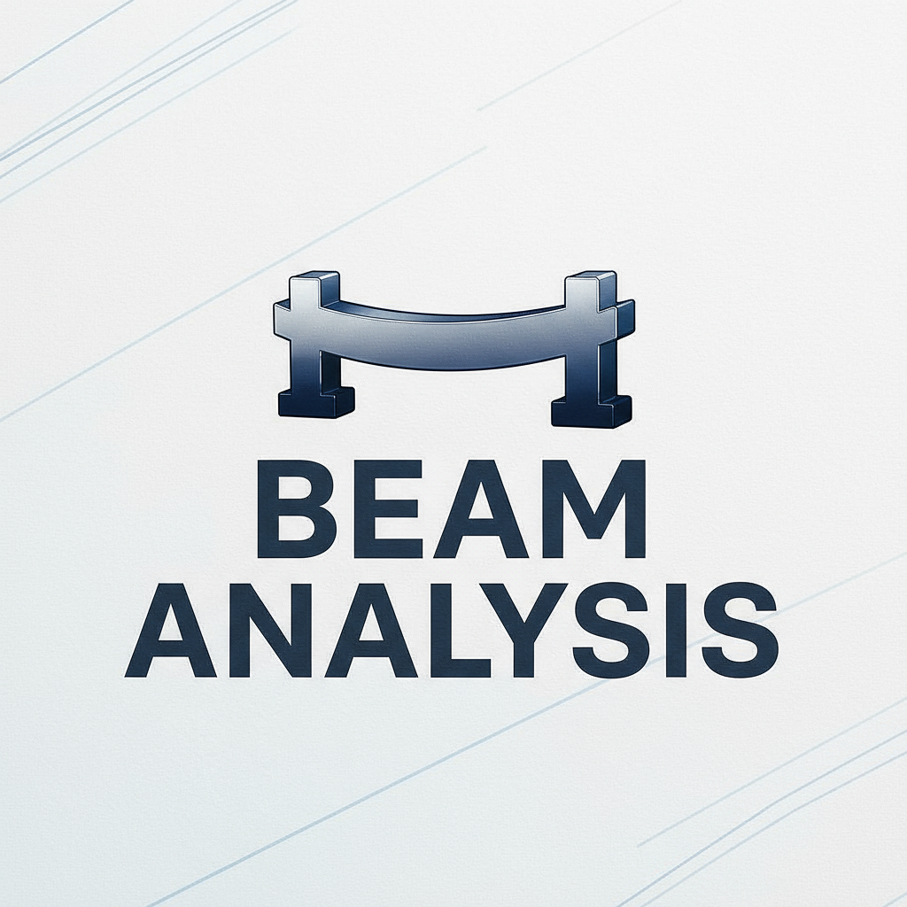

# Hut Beam Analysis

[](https://hutbeamanalysis.streamlit.app)

Ultra-fast beam calculator powered by a **sparse FEM** solver.  
**Live app:** https://hutbeamanalysis.streamlit.app

## Features
- Supports: pin / roller / fixed, spring supports
- Loads: point loads, UDL (uniform/linear), concrete hydro pressure
- Plots: Shear force, Bending moment, Deflection
- **Speed:** 0.001 m mesh at interactive speed (SciPy sparse solver)

## Quick start (local)
```bash
# (Windows)
python -m venv .venv
.venv\Scripts\activate
pip install -r requirements.txt
streamlit run app.py

## License
This project is licensed under the MIT License.  
See the [LICENSE](./LICENSE) file for details.
## Contact
Maintainer: Kaium Attar  
Email: [kaiumattar@gmail.com](mailto:kaiumattar@gmail.com)  
Live app: https://hutbeamanalysis.streamlit.app  
Issues & feedback: [Create an issue](https://github.com/kaiumattar/app.py/issues)
